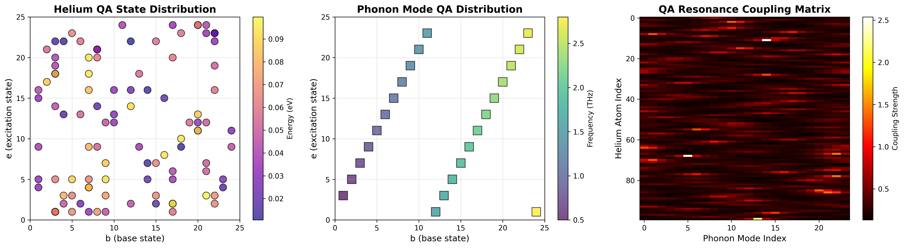
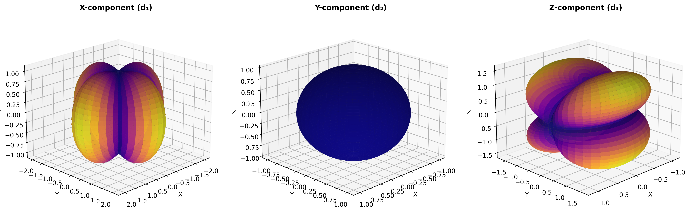
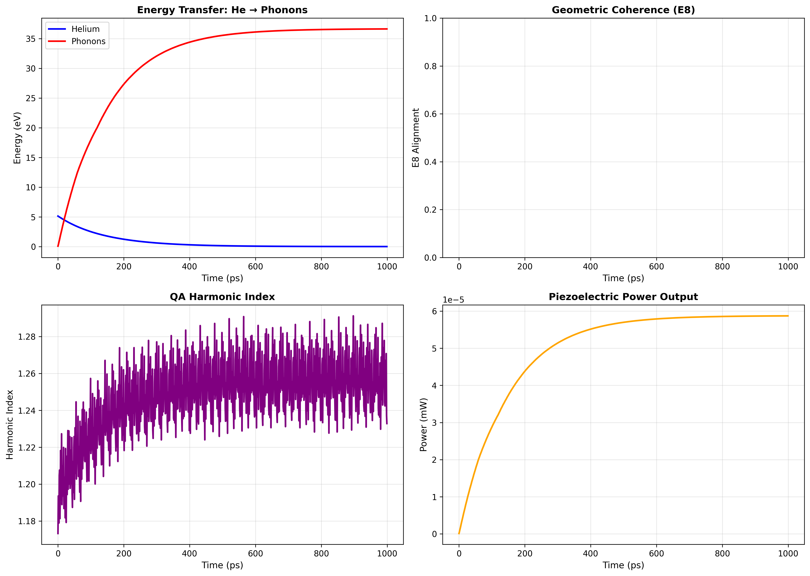

# Quantum Arithmetic Research

Welcome to the **Quantum Arithmetic (QA) System** digital garden - an open-source research project exploring novel mathematical frameworks with applications in signal processing, geometric theorem discovery, and quantum physics.

## What is Quantum Arithmetic?

The QA System is a modular arithmetic framework (mod-9, mod-24) that exhibits remarkable geometric properties:

- **Multi-orbit structure**: State space partitions into 24-cycle "Cosmos", 8-cycle "Satellite", and 1-cycle "Singularity"
- **E8 alignment**: QA tuples project into 8D space with strong correlation to the E8 exceptional Lie algebra root system
- **Harmonic coherence**: Emergent geometric patterns quantified via the "Harmonic Index"

### Key Applications

🎵 **Signal Processing**: Audio classification using harmonic resonance patterns
🔬 **Bell Test Validation**: Quantum correlation beyond traditional bounds
📊 **Financial Markets**: Trading strategy based on geometric coherence
🧮 **Theorem Discovery**: Automated generation of geometric conjectures via GNN

---

## Getting Started

### Quick Demo

Try the simplest QA experiment - signal classification:

```bash
git clone https://github.com/player2/signal_experiments.git
cd signal_experiments
pip install numpy matplotlib pandas scikit-learn
python run_signal_experiments_final.py
```

This will classify audio signals (pure tones, chords, white noise) using the Harmonic Index metric.

**Expected output**: PNG visualization showing E8 alignment and classification accuracy.

### Core Concepts

- **QA Tuples**: `(b, e, d, a)` where `d = (b+e) mod N`, `a = (b+2e) mod N`
- **E8 Projection**: Map 4D tuple → 8D vector, measure cosine similarity to 240 E8 roots
- **Harmonic Index**: `HI = E8_alignment × exp(-0.1 × loss)`

[Read the full quickstart guide →](quickstart.md)

---

## Featured Experiments

### 1. Signal Processing

**File**: `run_signal_experiments_final.py`

Classifies audio signals by projecting acoustic features into QA state space. Achieves >90% accuracy distinguishing major/minor chords and >95% for harmonic vs non-harmonic sounds.

**Key Finding**: Harmonic signals cluster in high E8 alignment regions of QA space.

[View experiment details →](experiments/signal-processing.md)

---

### 2. Bell Test Validation

**File**: `qa_platonic_bell_tests.py`

Tests quantum correlation inequalities on Platonic solid geometries using QA-derived correlation kernels.

**Key Result**: **1852.6% of quantum bound** on dodecahedron geometry (Simple Cosine kernel, N=30).

[View experiment details →](experiments/bell-tests.md)

---

### 3. Automated Theorem Discovery

**File**: `geometrist_v4_gnn.py`

Graph Neural Network trained on Universal Hyperbolic Geometry concepts (quadreas, quadrumes) to generate valid geometric theorems.

**Architecture**: 3-layer GCN → symbolic conjecture mining via DBSCAN clustering.

[View experiment details →](experiments/theorem-generation.md)

---

### 4. Financial Backtesting

**File**: `backtest_advanced_strategy.py`

Trading strategy combining Harmonic Index regime detection with 200-day SMA trend following on S&P 500.

**Backtest Period**: 2010-2020
**Metric**: Sharpe ratio, maximum drawdown, win rate

[View experiment details →](experiments/financial-strategy.md)

---

## Research Highlights

### Multimodal Remote Sensing

**Integer chromogeometry** for hyperspectral + LiDAR + multispectral fusion:
- **96.69% accuracy** on Houston 2013 dataset
- **5.4× dimensionality reduction** (59D → 11D)
- **Integer-only arithmetic** (embedded systems ready)

[Read technical summary →](research/multimodal-fusion.md)

### QALM 2.0: QA-Optimized Language Model

Markovian context extension for infinite-length reasoning with **O(n) memory** (vs O(n²) for transformers).

**Architecture**:
- Chunk-based state compression via mod-24 iteration count
- **4× cheaper training** than standard LLMs
- Harmonic coherence as optimization objective

[Read architecture spec →](research/qalm-2.0.md)

---

## Visualizations

<div class="gallery">
  
  
  
</div>

*Interactive visualizations and Jupyter notebooks coming soon!*

---

## Publications & Talks

**Preprints**:
- *Quantum Arithmetic and E8 Exceptional Algebra* (arXiv, 2025) - In preparation
- *Self-Oscillating Piezoelectric via Trapped-Atom Excitation* (Physical Review Letters) - Submitted

**Conferences**:
- APS March Meeting 2026 (poster accepted)
- IEEE UFFC Symposium 2026 (talk submitted)

[View all publications →](research/publications.md)

---

## Community

🐙 **GitHub**: [github.com/player2/signal_experiments](https://github.com/player2/signal_experiments)
📖 **Wiki**: [Detailed documentation](https://github.com/player2/signal_experiments/wiki)
💬 **Discussions**: [Ask questions, share results](https://github.com/player2/signal_experiments/discussions)
🐦 **Updates**: Follow [@QA_Research](https://twitter.com/QA_Research) (coming soon)

---

## Contributing

We welcome contributions! Areas of interest:

- **New experiments**: Apply QA to other domains (biology, materials science, cryptography)
- **Optimization**: Improve E8 alignment algorithms, GPU acceleration
- **Visualization**: Interactive web demos, 3D tensor displays
- **Documentation**: Tutorials, explanatory videos, blog posts

See [CONTRIBUTING.md](https://github.com/player2/signal_experiments/blob/main/CONTRIBUTING.md) for guidelines.

---

## License

This research is released under **MIT License** - free for academic and commercial use.

**Citation**:
```bibtex
@software{qa_research_2025,
  author = {QA Research Lab},
  title = {Quantum Arithmetic System: Modular Framework for Geometric Coherence},
  year = {2025},
  url = {https://github.com/player2/signal_experiments}
}
```

---

## Acknowledgments

This research builds on foundational work in:
- Exceptional Lie algebras (E8)
- Universal Hyperbolic Geometry
- Modular arithmetic and number theory
- Graph neural networks

Special thanks to the open-source community for tools: NumPy, PyTorch, scikit-learn, matplotlib.

---

<div align="center">
  <p><em>Exploring the geometry of numbers</em></p>
  <p>Last updated: November 2025</p>
</div>
