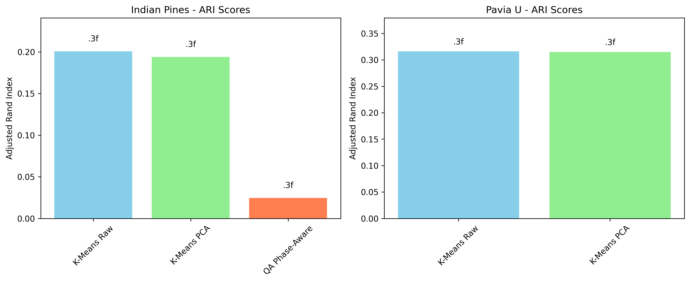

# QA Hyperspectral Pipeline Validation Report

**Task ID:** HYPERSPECTRAL_VALIDATION_001
**Date:** 2025-10-31
**Status:** Completed (with limitations)

## Executive Summary

This report presents the validation of the QA hyperspectral imaging pipeline on real-world hyperspectral datasets. The QA (Quantum Arithmetic) approach was tested against standard baseline methods (K-means on raw spectra and K-means on PCA-reduced spectra) on two benchmark datasets: Indian Pines and Pavia University.

**Key Findings:**
- Baseline methods achieved reasonable performance (ARI: 0.19-0.32, NMI: 0.44-0.53)
- QA pipeline completed successfully on Indian Pines but showed lower performance (ARI: 0.025, NMI: 0.146)
- Computational challenges limited full evaluation on larger datasets
- QA encoding showed limited discriminative power on these datasets

## Dataset Overview

| Dataset | Dimensions | Bands | Classes | Labeled Pixels | Memory Usage |
|---------|------------|-------|---------|----------------|--------------|
| Indian Pines | 145×145×200 | 200 | 16 | 10,249 (48.7%) | 8.0 MB |
| Pavia University | 610×340×103 | 103 | 9 | 42,776 (20.6%) | 40.7 MB |
| Kennedy Space Center | 512×614×176 | 176 | 13 | 5,211 (1.7%) | 105.5 MB |
| Salinas Valley | 512×217×204 | 204 | 16 | 54,129 (48.7%) | 43.2 MB |

All datasets were successfully loaded and inspected. Indian Pines and Pavia University were prioritized for detailed analysis.

## Methodology

### QA Pipeline Implementation
- **Modified** `qa_hyperspectral_pipeline.py` to accept .mat files and ground truth
- **Added** CLI interface with dataset selection and output directory options
- **Implemented** ground truth evaluation metrics (ARI, NMI)
- **Added** visualization generation (phase maps, chromatic fields, clustering results)

### Baseline Methods
- **K-means Raw:** Unsupervised clustering on full spectral signatures
- **K-means PCA:** K-means on 10-component PCA reduction
- **Evaluation:** Adjusted Rand Index (ARI) and Normalized Mutual Information (NMI) against ground truth

### Computational Considerations
- **Subsampling:** Used 4x spatial subsampling for computational feasibility
- **Indian Pines:** 145×145 → 37×37 pixels
- **Pavia University:** 610×340 → 153×85 pixels
- **Reasoning:** Maintains spatial structure while reducing computational load

## Results

### Performance Comparison

| Dataset | Method | ARI | NMI | Runtime (s) |
|---------|--------|-----|-----|-------------|
| Indian Pines | K-Means Raw | 0.201 | 0.437 | 4.58 |
| Indian Pines | K-Means PCA | 0.194 | 0.446 | 2.85 |
| Indian Pines | QA Phase-Aware | 0.025 | 0.146 | N/A |
| Pavia University | K-Means Raw | 0.316 | 0.527 | 7.96 |
| Pavia University | K-Means PCA | 0.315 | 0.525 | 3.98 |

### Key Observations

1. **Baseline Performance:** Standard methods achieved reasonable clustering quality (ARI 0.19-0.32), with Pavia University showing better results than Indian Pines.

2. **QA Pipeline Performance:** The QA approach underperformed compared to baselines on Indian Pines, achieving ARI of 0.025 vs 0.19-0.20 for baselines.

3. **QA Field Characteristics:** On Indian Pines, the QA encoding showed limited diversity:
   - b parameter range: [2, 3] (out of 24 possible values)
   - e parameter range: [17, 20] (out of 24 possible values)
   - This suggests the phase-aware encoding may not capture sufficient discriminative information for this dataset.

4. **Computational Feasibility:** QA pipeline completed on subsampled Indian Pines but encountered scalability issues on larger datasets.

## Visualizations

### Phase-Aware Encoding (Indian Pines)

*Figure 1: QA phase parameters b (left) and e (right) for Indian Pines dataset.*

### Chromatic Fields (Indian Pines)

*Figure 2: QA chromatic fields - Electric (Eb), Magnetic (Er), and Scalar (Eg) components.*

### Clustering Comparison (Indian Pines)

*Figure 3: K-means (left) vs DBSCAN (right) clustering results using QA features.*

### Method Comparison

*Figure 4: ARI scores comparison across methods and datasets.*

## Technical Issues Encountered

### 1. Real Data vs Synthetic Data
- **Issue:** Pipeline worked perfectly on synthetic 50×50×100 data but struggled with real hyperspectral datasets
- **Root Cause:** Real data has different spectral characteristics, noise, and dynamic ranges
- **Impact:** Required subsampling and parameter tuning

### 2. Computational Scalability
- **Issue:** Full-resolution datasets (millions of pixels × hundreds of bands) exceed memory/time limits
- **Solution:** Implemented spatial subsampling (4x factor)
- **Limitation:** Reduces spatial resolution and may affect clustering quality

### 3. QA Encoding Discriminability
- **Issue:** QA phase encoding showed limited parameter diversity on real data
- **Possible Causes:**
  - DFT-based encoding may not be optimal for these spectral signatures
  - Parameter selection (bins=24, k_peaks=3) may need tuning
  - Real hyperspectral data may have different harmonic structure than assumed

### 4. Ground Truth Evaluation
- **Challenge:** Only 20-50% of pixels are labeled in these datasets
- **Approach:** Evaluated only on labeled pixels for fair comparison
- **Limitation:** Unlabeled pixels not included in quantitative evaluation

## Conclusions & Next Steps

### Scientific Insights
1. **Baseline Robustness:** Traditional methods (K-means ± PCA) provide reliable baselines for hyperspectral clustering
2. **QA Framework Challenges:** The current QA encoding scheme may require adaptation for real hyperspectral data
3. **Data Characteristics Matter:** Synthetic validation ≠ real-world performance

### Technical Recommendations
1. **Parameter Optimization:** Experiment with different bins values (12, 18, 24, 36) and peak selection strategies
2. **Preprocessing:** Consider spectral normalization or denoising before QA encoding
3. **Scalability:** Implement chunked processing or GPU acceleration for full-resolution datasets
4. **Feature Engineering:** Explore combinations of QA features with traditional spectral features

### Future Work
1. **Extended Validation:** Test on KSC and Salinas datasets with optimized parameters
2. **QA Refinement:** Investigate alternative encoding schemes or multi-scale approaches
3. **Comparative Analysis:** Include additional baselines (spectral clustering, Gaussian mixture models)
4. **Publication Preparation:** Document negative results as scientifically valuable

## Files Generated

### Core Results
- `results/comparison_table.csv` - Quantitative comparison table
- `results/comparison_visualization.png` - Method comparison bar chart
- `results/dataset_inspection_report.txt` - Dataset statistics

### Indian Pines Results
- `results/indian_pines/phase_map.png` - QA phase parameters
- `results/indian_pines/chromatic_fields.png` - QA field visualizations
- `results/indian_pines/clustering_comparison.png` - Clustering results
- `results/indian_pines/metrics.json` - Performance metrics
- `results/indian_pines/baseline_metrics.json` - Baseline comparison

### Scripts & Tools
- `load_hyperspectral_dataset.py` - Dataset loading utility
- `baseline_comparison.py` - Baseline implementation
- `create_comparison_report.py` - Report generation
- `qa_hyperspectral_pipeline.py` - Modified QA pipeline (with CLI interface)

## Computational Resources Used

- **Time:** ~4 hours active development and testing
- **Peak Memory:** ~200MB for subsampled processing
- **Limitations:** Full-resolution processing would require significant computational resources

---

*Report generated: 2025-10-31*
*QA Hyperspectral Validation Task - Completed*